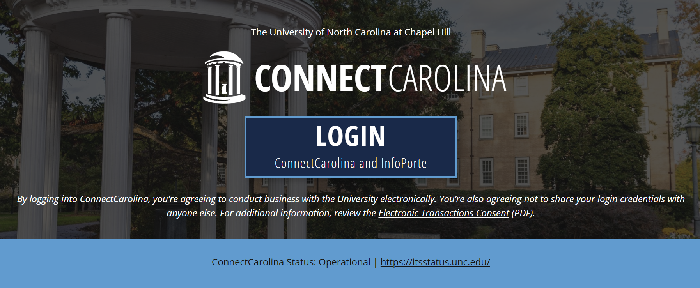

# a03-ConnectCarolina

___

## Introduction

For years, Tar Heels have suffered at the hands of ConnectCarolina. You've fought through confusing registration
windows, wrestled with mysteriously vanishing classes, and stared blankly at errors that offer no explanation.
ConnectCarolina has tested your patience, your sanity, and your GPA, but no more.

**In this assignment, your mission is to build a *better* ConnectCarolina that doesn’t crash when a course is
full, doesn’t silently fail your registration when prerequisites aren’t met, and actually tells users *what went wrong*.

Through the creation of dummy methods that are very similar to the core functionality of the website, you'll use exceptions to ensure that these method work like they're supposed to!

---

## 🟢 Novice

In this first part, you will start off with a simple methods that will handle calculating GPA:

### calculateGPA

_Finals season coming closer and wondering how your GPA will stand after this storm? This method will help students
calculate just that by letting student input information about their (anticipated) grades for the current semester!_

- Create a static method called calculateGPA that inputs the number of classes a student is taking and an array of grades (Strings represented as "A", "A-" ... "D","F") for each class and returns a sentence that includes the student's total GPA (more info in a moment)
    - check out the range of official gradepoints at https://registrar.unc.edu/your-grades/
- First, check if the number of classes are invalid (must be positive), and that the number of elements in the grades array matches the number of classes
    - If these tests fail, throw an IllegalArgumentException with an appropriate output
- Then, we'll calculate the GPA
    - You'll use the given helper method charToGrade() to convert these letter grades into doubles
        - charToGrade() inputs a string (such as "A-") and outputs the corresponding GPA
            - if it outputs -1, then the input was invalid!
    - Before summing these doubles, ensure that the output from charToGrade was valid!
        - If not, throw an IllegalArgumentException with the appropriate message
    - Sum up the given values for each class by going through all the values of the array containing letter grades and then divide this sum by the number of classes
- Lastly, return the string: "Your calculated GPA is: [calculated GPA]"

___

## 🧙 Adept

***"Dread it, run from it, those CLE credits still need to be fulfilled"*** - Thanos or someone

_You go to great lengths for those CLE credits — dragging friends to random events with free food, battling drowsiness during talks from
people you've never heard of, and pretending to care just long enough to scan the QR code. To
ensure everyone gets the recognition they deserve, you'll now implement:_

### Creating the eventCalendar

Before we can validate an event, we must first create the event calendar.

- Define a new instance variable called cleEvents, which should map a `String` date to a `String` name of event.
- Create a new method called `initCalendar()` that takes in no parameters, and returns nothing.  Instead, it should have the side effect of populating our event calendar with the following events:
    - `"August 18": "Fall FDOC"`
    - `"September 05": "Honor Code Workshop"`
    - `"October 12": "Leadership Summit"`
    - `"November 03": "Community Service Night"`
    - `"December 01": "Study Skills Clinic"`
- Add two more events of your choice.
- Finally, initialize the calendar in the constructor.

### Exceptions

#### CLEAlreadyScannedException
- This exception will be in the same folder as the rest of the files.
- create a custom `Exception` called **CLEAlreadyScannedException()**
- Give it a default error message of your choice, but also design it to accept custom messages.

#### CLEEventNotFoundException
- Repeat the steps above to create another custom exception with one difference:  this one should only take in a custom message and have no default.

### Validating the Scan
The idea is that we're scanning in event (passing it's name through the parameter), and outputting confirmation that the CLE credit has been awarded or throwing and handling exceptions.

- Make a new method called `validateScan` that will take the name of the event, and `List<String>` field called `scannedEvents` (that contains events that the student has already scanned) as parameters and returns nothing when finished.
- These are checked exceptions so you will have to `specify` them in the method header.
    - Validate that the hashmap of CLE Events contains the scanned event
        - If not, throw a `CLEEventNotFoundException` and include an appropriate message
    - Next, validate that the scanned event hasn't already been scanned using the List you created earlier
        - If it is you'll use the given exception `CLEAlreadyScannedException`!
    - If both of these checks are passed, fantastic!  The scan has been validated.

### getCLECredits
Finally, we are ready to give students a chance to earn those credits!

- Define a new method called `getCLECredits` that also takes in the name of the event, and `List<String>` field called `scannedEvents` (that contains events that the student has already scanned) as parameters
    - This method will return a modified `List<String>` upon completion.
    - In a try/catch block
        - validate that the scan
        - If and only if it is successful, add it to the scannedEvents list and print "Thank you for attending!"
- If you catch either of the thrown exceptions, print "Error scanning event: " along with the message of the exception
- Finally, print "CLE credit processed for: [eventname]"
- Return the scannedEvents back to the caller either in its original state if it wasn't valid, or with the added event if everything went through properly.
___

## Jedi

### DuoAuthenticationFailedException()

As part of the class you're about to implement next, you will now create another custom exception!

- Create a new Exception class called DuoAuthenticationFailedException, ensure it extends the Exception class
- The exception should output "Authentication failed: " followed by the message taken through
  the parameter.
- Example output: "Authentication failed, Student ID or day does not match."

### calculateValidDay

_Ever try to add a class and it's already full? Maybe the system is giving people earlier registration days than it should!This helper method will help calculate the valid day of the week that a student with a certain amount of credits should get to register for classes._

- Write a new method that has one parameter for the number of credits (We need to support half credits as well), and output a string of a day of the week.
- This is a *utility* method which means, it's going to be static.

    - If credits are between 0 and 55 (both inclusive), student's registration day should be Wednesday
    - If the credits are between 55 and (inclusive) 100, student's registration day should be Tuesday
    - If the student has more than 100 credits, they get the first day - Monday!
    - Otherwise, this means that the input was invalid and throw an IllegalArgumentException

### Creating the enrollment Map

Before we can authenticate anyone, we need to keep track of which students belong to which registration day.

- Define a new instance variable called `enrollment`, which should map a String day of the week to a set of students.
    - In addition to private, it should be static so that there is only one copy of the proper enrollment list.
    - The key will be the **day of the week** (e.g., `"Monday"`, `"Tuesday"`).
    - The value will be a data collection `set` of `Student` containing all students assigned to that day.

- Create a new method called `initStudents()` that takes in a `List<Student>` and returns nothing. Instead, it will:
    - Initialize the map with the weekdays (`"Monday"`, `"Tuesday"`, `"Wednesday"`, `"Thursday"`, `"Friday"`) each pointing to an empty `Set`.
    - Loop through the provided students:
        - Use the helper `calculateValidDay()` to figure out which registration day matches their number of credits.
        - Add the student to the appropriate `Set` in the map.
    - If a student has invalid credits (like negative numbers), catch the `IllegalArgumentException` and print an error message saying their credits weren’t valid.

_note: We are creating a static utility class.  Because of that, we won't need to call a constructor, so therefor we aren't making one._

### duoAuthenticate
_Have you ever been tired of authenticating duo everytime you open ConnectCarolina? Especially on registration days, when
you don't want to miss those precious seconds to a stupid notification on your phone asking you if you're logging in to
your computer? I'm just trying to make sure I get those gen-eds fulfilled :/_

Now, you will create a method that will help the system start a short no authentication window when a student opens
ConnectCarolina on their registration day. You will simulate what Duo should do: recognize that if a student logs in on their assigned Registration Day, require no further authentication by starting a 10-minute window representation by a boolean variable.
-- The idea is that if this boolean is true, the window is active, and vice versa.

- duoAuthenticate will take 2 parameters - one for the 9-digit student ID and one for the day the student is logging in on
    - It will return the true/false value that we talked about above
    - This method will use calculateValidDay() that we implemented earlier; You can get the number of credits that a student has by using student.getCredits();
- Create a variable that will store the authentication true/false value. Remember that the idea is that if this value is true, that means the 10 minute no authentication window is open.
- Grab the students ID from the student passed in.
- First, validate that the student ID is valid (is 9 digits)
    - If not, throw the DuoAuthenticationFailedException that you just made with an appropriate message
    - Check to see if the current day is the student's registration day.
    - If it is, validate that the student is actually in the list of students allowed to register today.
        - If either of these is not true, throw a DuoAuthenticationFailedException with an appropriate message.
    - Once the student has been validated, print "Duo authentication successful! Welcome, Bob.", using the student's name in the message.
 - Once finished, remember to return your boolean value!

### Main Simulator

Finally, we are ready to put all the pieces together.  You will see the difference between calling static methods and non-static methods.

In `AuthenticatorSimulator`, write a main method that does the following:
- Create a student.  Give it whatever name you want, and an ID, and give them 0 credits.
- Create an enchanter object.
- Have your student scan an event for "Leadership Summit".
- Ensure that the output shows that the leadership summit was successful.
- Next, creat a list of students, add your freshman to it, and use it to initialize the student enrollment in sorcerer.
- Create a boolean that represents the authentication window;
- in a try/catch block, authenticate your student on the proper day.  If there are any errors, catch it and print out the error.  
- Finally, print out "Thank you for visiting ConnectCarolina".  If it was successful, print "You are authenticated for the next 10 minutes", otherwise, "You will have to authenticate again".

## Merlin

Oh, you thought you were done?  Now you get to go back and find all the implicit runtime errors.  There should be no NullPointerExceptions possible in any method.  

___

##### Great job! You’ve successfully simulated parts of a functional ConnectCarolina! Go ahead, pat yourself on the back. But don’t get too comfy — there’s still Eduroam, the libraries' reservation system, the new kiosks at Bojangles, and 10 more things to fix :)

### Cowritten by [Prairie Goodwin](https://www.linkedin.com/in/prairie-goodwin/) and [Mann Barot](https://www.mannbarot.com)

