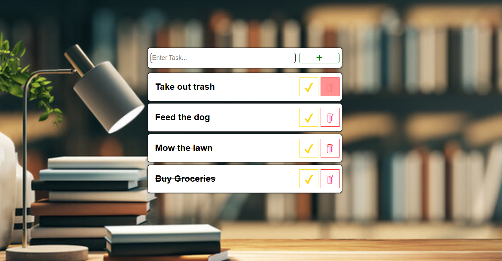

# To-Do List

## Overview
A simple To-Do List web application built with HTML, CSS, and JavaScript. Users can add tasks, mark tasks as completed, and remove tasks dynamically through an interactive interface.

## Features
- Add new tasks
- Mark tasks as completed
- Delete tasks
- Responsive task layout
- Interactive button hover effects
- Dynamic DOM manipulation using JavaScript

## Technologies Used
- HTML5
- CSS3
- JavaScript (ES6)

## How to Run
1. Clone the repository:
```bash
git clone https://github.com/LeonAaron/Portfolio.git
```
2. Navigate to the project folder:
```bash
cd Portfolio/TodoList
```
3. Open `index.html` in your browser.

## Project Files
- `index.html` – Application structure
- `styles.css` – Styling and layout
- `script.js` – Task interaction and DOM logic
- `images/` – Project assets and background images

## Screenshot


## Created By
Leon Aaron
