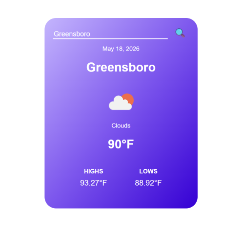

# Weather App

## Overview
Weather App is a JavaScript web application that displays real-time weather data for any city using the OpenWeather API. The app shows the current temperature, weather conditions, highs/lows, and weather icons through a clean responsive interface.

## Screenshot


## Features
- Search weather by city name
- Displays:
  - Current temperature
  - High and low temperatures
  - Weather condition and icon
  - Current date
- Real-time API data fetching
- Handles invalid city searches
- Responsive UI design

## Technologies Used
- HTML5
- CSS3
- JavaScript (ES6)
- OpenWeather API

## Installation
```bash
git clone https://github.com/LeonAaron/Portfolio.git
cd Portfolio/WeatherApp
```

## Running the Project
Open `index.html` in your browser.

## Project Files
- `index.html` – Application structure
- `style.css` – Styling and layout
- `script.js` – API requests and application logic

## API
This project uses the OpenWeather API:

https://openweathermap.org/api

## Created By
Leon Aaron
